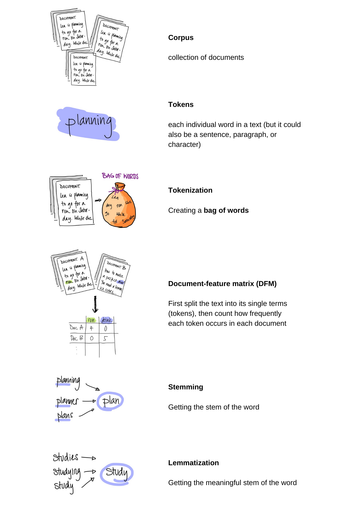

```{r setup, include=FALSE}
knitr::opts_chunk$set(echo = TRUE)
```

This code is accompanying material for [this talk](http://cosimameyer.rbind.io/slides/nlp-rladies/talk#1) for R-Ladies Bergen. 

Text data provides an oasis of information for both researchers and non-researchers alike to explore. Natural Language Processing (NLP) methods help make sense of this difficult data type, which is written text. The talk and code give you a smooth introduction to the [quanteda package](https://quanteda.io/). I will also showcase how to quickly visualize your text data and cover both supervised and unsupervised approaches in NLP. As part of the code demo, we will use text [data from the UN](https://doi.org/10.7910/DVN/0TJX8Y) as a working example to give you first insights into the structure of text data and how to work with it.

## Knowing terms and concepts

Before we get started, you might want to revise the terms and concepts once more (or use it as a glossary to look them up when needed). 



## Preparation

In a first step, we load the packages.

```{r package, results='hide', message=FALSE, include=TRUE, eval=TRUE, echo=TRUE}
## Packages
pkgs <- c(
  "knitr",
  "tidyverse",
  "quanteda",
  "readtext",
  "stm",
  "stminsights",
  "wordcloud",
  "gsl",
  "topicmodels",
  "caret",
  "kableExtra",
  "magrittr",
  "overviewR",
  "countrycode",
  "wesanderson",
  "tidytext",
  "prettydoc"
)

## Install uninstalled packages
lapply(pkgs[!(pkgs %in% installed.packages())], install.packages)

## Load all packages to library
lapply(pkgs, library, character.only = TRUE)

## Set a theme for the plots:
theme_set(
  theme_minimal() + theme(
    strip.background = element_blank(),
    panel.grid.major = element_blank(),
    panel.grid.minor = element_blank()
  )
)
```

## How to deal with text data?

Remember, we will use [`quanteda`](https://quanteda.io/) in this workshop. Starting with `quanteda` basically works in 3-4 different steps:

1. **Import** the data 

2. Build a **corpus**

3. **Pre-process your data**

4. Calculate a **document-feature matrix** (DFM)

And we will walk through each of them now.

1. **Import** the data 

```{r data-load, echo=TRUE}
# Load packages
library(quanteda) # For NLP

load("../data/UN-data.RData")
```

Before we proceed, we check the data and the time and geographical coverage of the data:

```{r, data-check 1, echo=TRUE}
head(un_data)
```

What we see is that our data set has five variables containing information on `doc_id`, `text`, `country`, `session`, and `year`. The text of the speech is stored in the variable `text`, the `doc_id` gives us a unique id for each document.

No we turn to the time and geographical coverage:

```{r, data-check 2, echo=TRUE}
un_data %>%
  overview_tab(id = country, time = year)
```

To decrease the sample size, I reduced the data set and it now only captures data from 2000 onwards.

2. Build a **corpus**

```{r corpus, echo=TRUE}
# Build the corpus
mycorpus <- corpus(un_data)

# Assigns a unique identifier to each text
docvars(mycorpus, "Textno") <-
  sprintf("%02d", 1:ndoc(mycorpus)) 
```

3. Text **pre-processing** (not all steps are always required). This way, we get the tokens.

```{r rtokens, echo=TRUE}
# Create tokens
token <-
  tokens(
    # Takes the corpus
    mycorpus,
    # Remove numbers
    remove_numbers = TRUE,
    # Remove punctuation
    remove_punct = TRUE,
    # Remove symbols
    remove_symbols = TRUE,
    # Remove URL
    remove_url = TRUE,
    # Split up hyphenated words
    split_hyphens = TRUE,
    # And include the doc vars (we'll need them later)
    include_docvars = TRUE
  )
```

Since the data is generated with OCR, we need to additionally clean this. We do this using the following command:

```{r ocr-cleaning, results='hide', message=FALSE, echo=TRUE}
# Clean tokens created by OCR
token_ungd <- tokens_select(
  token,
  c("[\\d-]", "[[:punct:]]", "^.{1,2}$"),
  selection = "remove",
  valuetype = "regex",
  verbose = TRUE
)
```

4. Calculate a **document-feature matrix** (DFM)

Here, we also stem, remove stop words and lower case words.

```{r dfm, echo=TRUE}
mydfm <- dfm(
  # Take the token object
  token_ungd,
  # Lower the words
  tolower = TRUE,
  # Get the stem of the words
  stem = TRUE,
  # Remove stop words
  remove = stopwords("english")
)
```

Have a look at the DFM:

```{r head-dfm-normal, echo=TRUE}
head(mydfm)
```

Trim data: remove all the words that appear less than 7.5% of the time and more than 90% of the time

```{r dfm-trim, echo=TRUE}
mydfm.trim <-
  dfm_trim(
    mydfm,
    min_docfreq = 0.075,
    # min 7.5%
    max_docfreq = 0.90,
    #  max 90%
    docfreq_type = "prop"
  ) 
```


## Visualizing your data

#### Word clouds

To get a first and easy visualization, we use word clouds:

```{r word-cloud, echo=TRUE}
quanteda::textplot_wordcloud(
  # Load the DFM object
  mydfm,
  # Define the minimum number the words have to occur
  min_count = 3,
  # Define the maximum number the words can occur
  max_words = 500,
  # Define a color
  color = wes_palette("Darjeeling1")
)
```

Word clouds are an illustrative way to show what you have in your data. You can also use word clouds beyond NLP analysis purposes, e.g., on a [website](https://www.uni-mannheim.de/conflict-dynamics/past-workshops/workshop-2020/).

#### Frequency plot

```{r frequency-plot, echo=TRUE}
# Inspired here: https://bit.ly/37MCEHg

# Get the 30 top features from the DFM
freq_feature <- topfeatures(mydfm, 30)

# Create a data.frame for ggplot
data <- data.frame(list(
  term = names(freq_feature),
  frequency = unname(freq_feature)
))

# Plot the plot
data %>%
  ggplot() +
  # Call a point plot with the terms on the x-axis and the frequency on the y-axis
  geom_point(aes(x = reorder(term, frequency), y = frequency)) +
  # Flip the plot
  coord_flip() +
  # Add labels for the axes
  xlab("") +
  ylab("Absolute frequency of the features")
```

## Known categories

#### Dictionary approach

We use the [LexiCoder Policy Agenda](https://www.comparativeagendas.net) dictionary. It [captures major topics from the comparative Policy Agenda project and is currently available in Dutch and English.](https://www.mzes.uni-mannheim.de/socialsciencedatalab/article/advancing-text-mining/)

```{r dic-topic, echo=TRUE}
# Load the dictionary with quanteda's built-in function
dict <- dictionary(file = "../data/policy_agendas_english.lcd")
```

Using this dictionary, we now generate our DFM:

```{r dfm-topic, echo=TRUE}
# Generate the DFM...
mydfm.un <- dfm(mydfm.trim, 
                # Based on country
                groups = "country",
                # And the previously loaded dictionary
                dictionary = dict)
```

Have a look at the new DFM:

```{r head-topic, echo=TRUE}
head(mydfm.un)
```

Before we can turn to the plotting, we need to wrangle the data bit to bring it in the right order. These are basic tidyverse commands.

```{r topic-wrangling, echo=TRUE}
un.topics.pa <- 
  # Convert the DFM to a data frame
  convert(mydfm.un, "data.frame") %>%
  # Rename the doc_id to country
  dplyr::rename(country = doc_id) %>%
  # Select relevant variables
  dplyr::select(country, macroeconomics, intl_affairs, defence) %>%
  # Bring the data set in a different order
  tidyr::gather(macroeconomics:defence, key = "topic", value = "share") %>%
  # Group by country
  group_by(country) %>%
  dplyr::mutate(
    # Generate the relative share of topics
    share = share / sum(share),
    # Make topic a factor
    topic = haven::as_factor(topic))
```

Based on this data set, we now generate the plot.

```{r plot-topic, echo=TRUE}
# Generate the plot
un.topics.pa %>%
  # We have country on the x-axis and the share on the y-axis, we color and fill by topic
  ggplot(aes(x = country, y = share, colour = topic, fill = topic)) +
  # Call the `geom_bar`
  geom_bar(stat = "identity") +
  # Define the fill colors and the labels in the legend
  scale_fill_manual(
    values = wes_palette("Darjeeling1"),
    labels = c("Macro-economic", "International affairs", "Defence")
  ) +
  # Same for the colors
  scale_color_manual(
    values = wes_palette("Darjeeling1"),
    labels = c("Macro-economic", "International affairs", "Defence")
  ) +
  # Add a title
  ggtitle("Distribution of PA topics in the UN General Debate corpus") +
  # And add x-axis and y-axis labels
  xlab("") +
  ylab("Topic share (%)") +
  # And last do some tweaking with the theme
  theme(axis.text.x = element_blank(),
        axis.ticks.x = element_blank())
```

#### Sentiment analysis

Here, we need to define more stopwords (create a manual list of them) to make sure that we do not bias our results. I have a non-exhaustive list here:

```{r sentiment-stopwords, echo=TRUE}
# Define stopwords
UNGD_stopwords <-
  c(
    "good bye",
    "good morning",
    "unit",
    "nation",
    "res",
    "general",
    "assemb",
    "mr",
    "greet",
    "thank",
    "congratulat",
    "sir",
    "per",
    "cent",
    "mdgs",
    "soo",
    "han",
    "ó",
    "g",
    "madam",
    "ncds",
    "sdgs",
    "pv",
    "isil",
    "isi",
    "f",
    "fifti",
    "sixtieth",
    "annan",
    "kofi",
    "fifth",
    "fourth",
    "first",
    "second",
    "third",
    "sixth",
    "seventh",
    "eighth",
    "ninth",
    "tenth",
    "seventieth",
    "jeremić",
    "agenda",
    "obama",
    "julian",
    "sergio",
    "mello",
    "septemb",
    "document",
    "plenari",
    "jean",
    "eliasson",
    "anniversari",
    "vieira",
    "haya",
    "rash",
    "treki"
  )
```

To apply it, we re-start from step 4 creating a DFM. 

We know apply it to our function

```{r dfm-sentiment, echo=TRUE}
# Remove self-defined stopwords
mydfm_sentiment <- dfm(
  # Select the token object
  token_ungd,
  # Lower the words
  tolower = TRUE,
  # Stem the words
  stem = TRUE,
  # Remove stop words and self-defined stop words
  remove = c(UNGD_stopwords, stopwords("english"))
)
```

Trim data: remove all the words that appear less than 7.5% of the time and more than 90% of the time

```{r dfm-trim-sentiment, echo=TRUE}
mydfm.trim <-
  dfm_trim(
    # Select the DFM object
    mydfm_sentiment,
    min_docfreq = 0.075,
    # min 7.5%
    max_docfreq = 0.90,
    # max 90%
    docfreq_type = "prop"
  ) 
```

And now we get the sentiment :-)
There are multiple ways how to do it, we will use one that is built in quanteda. In any case, it is important to check the underlying dictionary (on which basis is it built on?). 
The most frequently used dictionaries are:

- [NRC](https://saifmohammad.com/WebPages/NRC-Emotion-Lexicon.htm)
- [Bing](https://www.cs.uic.edu/~liub/FBS/sentiment-analysis.html)
- [AFINN](http://www2.imm.dtu.dk/pubdb/pubs/6010-full.html)
- and [LSD (Lexicoder Sentiment Dictionary by Young and Sorok)](http://www.snsoroka.com/data-lexicoder/)
For a more fine-grained approach, there is also the [`sentimentr` package](https://github.com/trinker/sentimentr), that my co-author, Dennis Hammerschmidt, and I use in our [paper](https://www.tectum-shop.de/titel/chinas-rolle-in-einer-neuen-weltordnung-id-97867/) on sentiment at the UNGD.

We will go with the LSD dictionary here as it is already built in quanteda.

```{r sentiment-dict, echo=TRUE}
# Call a dictionary
dfmat_lsd <-
  dfm(mydfm.trim,
      dictionary =
        data_dictionary_LSD2015[1:2])
```

We can look  at the dictionary first choosing the first 5 documents:

```{r sentiment-head, echo=TRUE}
head(dfmat_lsd, 5)
```


To better work with the data, we convert it to a data frame:

```{r convert-dfm, echo=TRUE}
# Calculate the overall
# share of positive and
# negative words on a scale
data <- convert(dfmat_lsd,
                to = "data.frame")
```

To get more meaningful results, we do some last tweaks:

```{r sentiment-wrangling, echo=TRUE}
data %<>%
  dplyr::mutate(
    # Generate the number of total words
    total_words = positive + negative,
    # Generate the relative frequency
    pos_perc = positive / total_words * 100,
    neg_perc = negative / total_words * 100,
    # Generate the net sentiment
    net_perc = pos_perc - neg_perc
  )

# Generate country code and year
data %<>%
  dplyr::mutate(# Define the country-code (it's all in the document ID)
    ccode = str_sub(doc_id, 1, 3),
    # Define the year (it's also in the document ID)
    year = as.numeric(str_sub(doc_id, 8, 11))) %>%
  # Drop all observations with "EU_" because they are not a single country
  dplyr::filter(ccode != "EU_") %>%
  # Drop the variable doc_id
  dplyr::select(-doc_id)
```

We first get an overall impression by plotting the average net sentiment by continent over time:

```{r vis-avg-sentiment, echo=TRUE}
data %>%
  # Generate the continent for each country using the `countrycode()` command
  dplyr::mutate(continent = countrycode(ccode, "iso3c", "continent", custom_match =
                                          c("YUG" = "Europe"))) %>%
  # We group by continent and year to generate the average sentiment by continent 
  # and and year  
  group_by(continent, year) %>%
  dplyr::mutate(avg = mean(net_perc)) %>%
  # We now plot it
  ggplot() +
  # Using a line chart with year on the x-axis, the average sentiment by continent
  # on the y-axis and colored by continent
  geom_line(aes(x = year, y = avg, col = continent)) +
  # Define the colors
  scale_color_manual(name = "", values = wes_palette("Darjeeling1")) +
  # Label the axes
  xlab("Time") +
  ylab("Average net sentiment") 
```

And now we want to visualize the results in more detail :-)

```{r vis-sentiment, results='hide', message=FALSE, warning=FALSE, echo=TRUE}
data %>%
  # Generate the country name for each country using the `countrycode()` command
  dplyr::mutate(countryname = countrycode(ccode, "iso3c", "country.name")) %>%
  # Filter and only select specific countries that we want to compare
  dplyr::filter(countryname %in% c(
    "Germany",
    "France",
    "United Kingdom",
    "Norway",
    "Spain",
    "Sweden"
  )) %>%
  # Now comes the plotting part :-)
  ggplot() +
  # We do a bar plot that has the years on the x-axis and the level of the 
  # net-sentiment on the y-axis
  # We also color it so that all the net-sentiments greater 0 get a 
  # different color
  geom_col(aes(
    x = year,
    y = net_perc,
    fill = (net_perc > 0)
  )) +
  # Here we define the colors as well as the labels and title of the legend
  scale_fill_manual(
    name = "Sentiment",
    labels = c("Negative", "Positive"),
    values = c("#C93312", "#446455")
  ) +
  # Now we add the axes labels
  xlab("Time") +
  ylab("Net sentiment") +
  # And do a facet_wrap by country to get a more meaningful visualization
  facet_wrap(~ countryname)
```


## Unknown categories

#### Structural topic models

We use the [`stm` package here](https://cran.r-project.org/web/packages/stm/vignettes/stmVignette.pdf). Quanteda also has [built-in topic models such as LDA](https://tutorials.quanteda.io/machine-learning/topicmodel/).

In a first step, we assign a topic count. Usually the number of topics can be higher -- but that obviously comes at a cost. Here, it's computational power. To make it as fast as possible, we'll pick 5 topics for our example.

```{r topic-stm, echo=TRUE}
# Assigns the number of topics
topic.count <- 5 
```

```{r dfm-to-stm, echo=TRUE}
# Convert the trimmed DFM to a STM object
dfm2stm <- convert(mydfm.trim, to = "stm")

# Use this object to estimate the structural topic model
model.stm <- stm(
  # Define the documents
  documents = dfm2stm$documents,
  # Define the words in the corpus
  vocab = dfm2stm$vocab,
  # Define the number of topics
  K = topic.count,
  # Define the data set that contains content variables (remember, this is what is so great about STM!)
  data = dfm2stm$meta,
  # This defines the initialization method. "spectral" is the default and provides a deterministic
  # initialization based on Arora et al. 2014 (it is in particular recommended if the number of
  # documents is large)
  init.type = "Spectral"
)
```

There are different ways to visualize the results. We'll first go with base-plot which gives you a shared estimation of the topic shares.

```{r plot-stm, echo=TRUE}
plot(
  # Takes the STM object
  model.stm,
  # Define the type of plot
  type = "summary",
  # Define font size
  text.cex = 0.5,
  # Label the title
  main = "STM topic shares",
  # And the x-axis
  xlab = "Share estimation"
)
```

You can also [combine `stm` with `tidytext`](https://juliasilge.com/blog/sherlock-holmes-stm/) to generate `ggplot2` objects. We follow [Julia Silge's outline](https://juliasilge.com/blog/sherlock-holmes-stm/) here. The plot shows the probabilities with which different terms are associated with the topics.

```{r stm-tidy, echo=TRUE}
# Turn the STM object into a data frame. This is necessary so that we can work with it.
td_beta <- tidy(model.stm)

td_beta %>%
  # Group by topic
  group_by(topic) %>%
  # Take the top 10 based on beta
  top_n(10, beta) %>%
  # Ungroup
  ungroup() %>%
  # Generate the variables topic and term
  dplyr::mutate(topic = paste0("Topic ", topic),
                term = reorder_within(term, beta, topic)) %>%
  # And plot it
  ggplot() +
  # Using a bar plot with the terms on the x-axis, the beta on the y-axis, filled by topic
  geom_col(aes(x = term, y = beta, fill = as.factor(topic)),
           alpha = 0.8,
           show.legend = FALSE) +
  # Do a facet_wrap by topic
  facet_wrap(~ topic, scales = "free_y") +
  # And flip the plot
  coord_flip() +
  scale_x_reordered() +
  # Label the x-axis, y-axis, as well as title
  labs(
    x = NULL,
    y = expression(beta),
    title = "Highest word probabilities for each topic",
    subtitle = "Different words are associated with different topics"
  ) +
  # And finally define the colors
  scale_fill_manual(values = wes_palette("Darjeeling1"))
```

You could also visualize our results with a perspective plot that allows you to show how different terms are related with each topic. We again use a base plot here.

```{r stm-perspective, echo=TRUE}
plot(
  # Access the STM object
  model.stm,
  # Select the type of plot
  type = "perspectives",
  # Select the topics
  topics = c(4, 5),
  # Define the title
  main = "Putting two different topics in perspective")
```

## Next steps

These are just the most basic supervised and unsupervised models in NLP that you can use but as you work more and more with textual data, you will see that there is so much more in the field of NLP including [document similarity](http://cosimameyer.rbind.io/slides/nlp-rladies/talk#56), [text generation](https://arxiv.org/abs/1906.01946) or even [chat bots](http://cosimameyer.rbind.io/slides/nlp-rladies/talk#57) that you can create using your knowledge and the same simple steps that we have used here.

## More resources

- Quanteda

  - [Kohei Watanabe and Stefan Müller: Quanteda Tutorials](https://tutorials.quanteda.io)

- More on text mining
  - [Cosima Meyer and Cornelius Puschmann: Advancing Text Mining with R and quanteda](https://www.mzes.uni-mannheim.de/socialsciencedatalab/article/advancing-text-mining/)

- Sentiment analysis
  - [sentimentr](https://github.com/trinker/sentimentr)
  - [Hammerschmidt/Meyer 2020: Money Makes the World Go Frowned - Analyzing the Impact of Chinese Foreign Aid on States' Sentiment Using Natural Language Processing](https://www.tectum-shop.de/titel/chinas-rolle-in-einer-neuen-weltordnung-id-97867/)

- Model validation
  - [oolong: Validation of dictionary approaches and topic models](https://cran.r-project.org/web/packages/oolong/index.html)
  - [stminsights](https://github.com/cschwem2er/stminsights)

